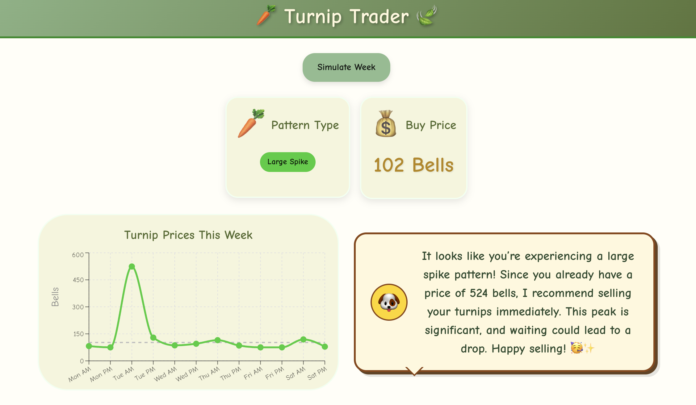

# Turnip Trader  

Turnip Trader is an AI-powered turnip price simulator and advisor for *Animal Crossing*.  
It combines the simulation of in-game price patterns with **RAG (Retrieval-Augmented Generation)** over community trading guides to generate practical advice on when to sell.  

  

## **Live Demo:** [Turnip Trader](https://turnip-trader.vercel.app/)

### Features  

- **Turnip Price Simulation**: Simulate a full week of realistic prices based on in-game mechanics.  
- **RAG System**: Retrieve strategies and insights from a vector database of community guides.  
- **LLM-Powered Advice**: Combine your simulated week with retrieved guides for personalized recommendations from Animal Crossing's Isabelle.  
- **Vector Database**: PostgreSQL with pgvector stores embeddings of trading guides for semantic search.  

### Tech Stack  

- **Frontend**: React + TypeScript  
- **Backend**: Node.js + Express  
- **Database**: PostgreSQL + pgvector for vector similarity search  
- **AI**: OpenAI GPT-4 + text-embedding-3-small  
- **Deployment**: Vercel (frontend) + Render (backend)

### How It Works  

1. **Simulate Scenario** – Simulate a week of turnip prices using real Animal Crossing patterns
2. **Semantic Search** – Find relevant trading strategies from embedded guide database  
3. **Isabelle's Analysis** – Isabelle combines scenario + guides to provide contextual advice
4. **Visual Display** – View patterns through charts and cards with Animal Crossing styling
